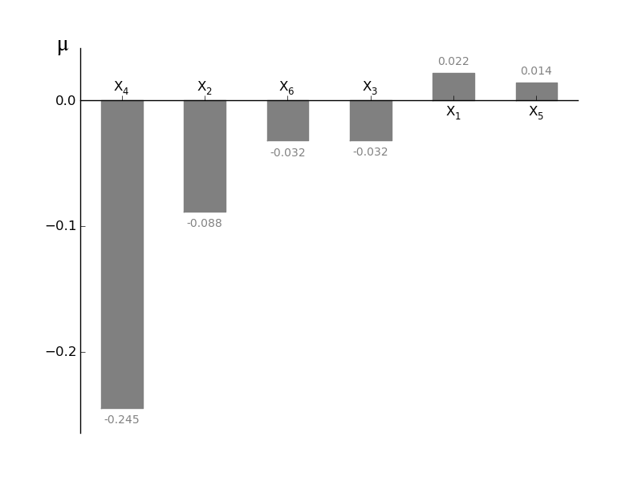
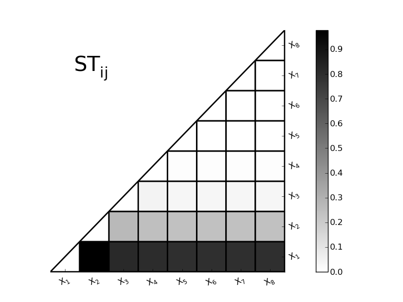
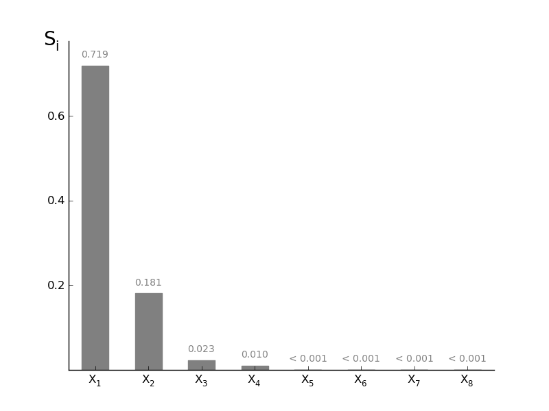

Sensitivity Analysis
=====================

Sensitivity Base class
-------------------------

.. autoclass:: pystran.SensitivityAnalysis
	:members: print_methods
	
Interaction with models
^^^^^^^^^^^^^^^^^^^^^^^^^
.. automethod:: pystran.SensitivityAnalysis.WritePre

.. automethod:: pystran.SensitivityAnalysis.ReadRuns

.. automethod:: pystran.SensitivityAnalysis.run_pyFUSE

Morris Screening method
-------------------------

Main Morris screening methods
^^^^^^^^^^^^^^^^^^^^^^^^^^^^^^
   
.. autoclass:: pystran.MorrisScreening
	:members: Sampling_Function_2, Optimized_Groups, Morris_Measure_Groups, runTestModel
	

Testing the selected traject optimization
^^^^^^^^^^^^^^^^^^^^^^^^^^^^^^^^^^^^^^^^^^^
.. automethod:: pystran.MorrisScreening.Optimized_diagnostic
	
.. image:: ex_Morris_oldsampl.png
	:scale: 50 %

.. image:: ex_Morris_optsampl.png 
	:scale: 50 %
	
Output plots and exports
^^^^^^^^^^^^^^^^^^^^^^^^^

.. automethod:: pystran.MorrisScreening.plotmu

.. automethod:: pystran.MorrisScreening.plotmustar

.. image:: ex_morris_mustar.png 
	:scale: 75 %

.. automethod:: pystran.MorrisScreening.plotsigma

.. image:: ex_morris_sigma.png 
	:scale: 75 %

.. automethod:: pystran.MorrisScreening.plotmustarsigma

.. image:: ex_plotmustarsigma.png 
	:scale: 75 %

.. automethod:: pystran.MorrisScreening.latexresults

:: 

	\begin{table}{lccc}
	\tablewidth{0pc}
	\tablecolumns{4}
	\caption{Morris evaluation criteria\label{tab:morris1tot}}
	\tablehead{
	  & $\mu$ & $\mu^*$ & $\sigma$  }
	\startdata
	$X_1$ & 0.019 & 0.053 & 0.062\\
	$X_2$ & -0.014 & 0.28 & 0.37\\
	$X_3$ & 0.35 & 1.8 & 2.2\\
	$X_4$ & 0.58 & 0.77 & 0.66\\
	$X_5$ & -0.0091 & 0.029 & 0.035\\
	$X_6$ & 0.023 & 0.088 & 0.11\\
	\enddata
	\end{table}

.. automethod:: pystran.MorrisScreening.txtresults	

:: 

	Par 	 mu 	 mustar 	 sigma 
	$X_1$ 	 0.01923737 	  0.05295802 	  0.06235872 
	$X_2$ 	 -0.01423402 	  0.27864841 	  0.36502709 
	$X_3$ 	 0.35127671 	  1.79863549 	  2.19419533 
	$X_4$ 	 0.57758340 	  0.76929478 	  0.66397173 
	$X_5$ 	 -0.00912314 	  0.02933937 	  0.03503700 
	$X_6$ 	 0.02319802 	  0.08834758 	  0.10503778 
	

Standardized Regression Coefficients (SRC) method
--------------------------------------------------

Main SRC methods
^^^^^^^^^^^^^^^^^^^^^^^^^^^^^^
   
.. autoclass:: pystran.SRCSensitivity
	:members: PrepareSample, Calc_SRC

Quick analysis of the scatter plots of the ouput versus the parameter values
^^^^^^^^^^^^^^^^^^^^^^^^^^^^^^^^^^^^^^^^^^^^^^^^^^^^^^^^^^^^^^^^^^^^^^^^^^^^^^^
.. automethod:: pystran.SRCSensitivity.quickscatter

Output image: 
	
	.. image:: ex_SRC_scatter.png
		:scale: 50 %
			
	
Output plots and exports
^^^^^^^^^^^^^^^^^^^^^^^^^
.. automethod:: pystran.SRCSensitivity.plot_tornado

Output image:

	.. image:: ex_SRC_tornado.png
		:scale: 50 %

.. automethod:: pystran.SRCSensitivity.plot_SRC

Output image if a single output is selected:

	.. image:: ex_SRC_single.png
		:scale: 50 %

Output image if a all outputs are selected:

	.. image:: ex_SRC_all.png
		:scale: 50 %

.. automethod:: pystran.SRCSensitivity.latexresults

:: 

	\begin{table}{lccccc}
	\tablewidth{0pc}
	\tablecolumns{6}
	\caption{Global SRC parameter ranking\label{tab:SRCresult}}
	\tablehead{
	 & o1 & o2 & o3 & o4 & o5  }
	\startdata
	$X_1$ & 5 & 5 & 5 & 5 & 5\\
	$X_2$ & 4 & 4 & 4 & 4 & 4\\
	$X_3$ & 3 & 3 & 3 & 3 & 3\\
	$X_4$ & 2 & 2 & 2 & 2 & 2\\
	$X_5$ & 1 & 1 & 1 & 1 & 1\\
	$X_6$ & 6 & 6 & 6 & 6 & 6\\
	\enddata
	\end{table}

.. automethod:: pystran.SRCSensitivity.txtresults	

:: 

	Par	 o1	 o2	 o3	 o4	 o5
	$X_1$ 	 0.0778505546741	 0.0778505546741	 0.0778505546741	 0.0778505546741	 0.0778505546741 
	$X_2$ 	 0.233670804823	 0.233670804823	 0.233670804823	 0.233670804823	 0.233670804823 
	$X_3$ 	 -0.6	 0.389115599046	 0.389115599046	 0.389115599046	 0.389115599046 
	$X_4$ 	 0.544743494911	 0.544743494911	 0.544743494911	 0.544743494911	 0.544743494911 
	$X_5$ 	 0.700482475678	 0.700482475678	 0.700482475678	 0.700482475678	 0.700482475678 
	$X_6$ 	 0.0778270555871	 0.0778270555871	 0.0778270555871	 0.0778270555871	 0.0778270555871 

Sobol Variance based method
-----------------------------

Main Sobol variance methods
^^^^^^^^^^^^^^^^^^^^^^^^^^^^^^
   
.. autoclass:: pystran.SobolVariance
	:members: Sobolsampling, SobolVariancePre, SobolVariancePost, runTestModel

Check the convergence of the analysis
^^^^^^^^^^^^^^^^^^^^^^^^^^^^^^^^^^^^^^^^^^^
.. automethod:: pystran.SobolVariance.sens_evolution
	
.. image:: ex_sobol_evSi.png
	:scale: 50 %

.. image:: ex_sobol_evSTi.png
	:scale: 50 %	
	
Output plots and exports
^^^^^^^^^^^^^^^^^^^^^^^^^

.. automethod:: pystran.SobolVariance.plotSTij

.. automethod:: pystran.SobolVariance.plotSTi

.. image:: ex_sobol_STi.png 
	:scale: 75 %		

.. automethod:: pystran.SobolVariance.plotSi

	
.. automethod:: pystran.SobolVariance.latexresults

:: 

	\begin{table}{lcc}
	\tablewidth{0pc}
	\tablecolumns{3}
	\caption{First order and Total sensitivity index\label{tab:sobol1tot}}
	\tablehead{
	  & $S_i$ & $S_{Ti}$  }
	\startdata
	par1 & 0.72 & 0.79\\
	par2 & 0.18 & 0.24\\
	par3 & 0.023 & 0.034\\
	par4 & 0.0072 & 0.010\\
	par5 & 0.000044 & 0.00011\\
	par6 & 0.000068 & 0.00011\\
	par7 & 0.000028 & 0.00010\\
	par8 & 0.000049 & 0.00011\\
	SUM & 0.93 & 1.1\\
	\enddata
	\end{table}

.. automethod:: pystran.SobolVariance.txtresults	

:: 

	Par 	 Si 	 STi 
	par1 	 0.71602494 	  0.78797717 
	par2 	 0.17916175 	  0.24331297 
	par3 	 0.02346677 	  0.03437614 
	par4 	 0.00720168 	  0.01044238 
	par5 	 0.00004373 	  0.00010526 
	par6 	 0.00006803 	  0.00010556 
	par7 	 0.00002847 	  0.00010479 
	par8 	 0.00004918 	  0.00010522 
	SUM 	 0.92604455 	  1.07652948

	
Latin-Hypercube OAT method
-----------------------------

Main GLobal OAT methods
^^^^^^^^^^^^^^^^^^^^^^^^^^^^^^
   
.. autoclass:: pystran.GlobalOATSensitivity
	:members: PrepareSample, Calc_sensitivity, 

	
Output plots and exports
^^^^^^^^^^^^^^^^^^^^^^^^^

.. automethod:: pystran.GlobalOATSensitivity.Get_ranking

.. automethod:: pystran.GlobalOATSensitivity.plotsens

.. image:: ex_globaloat_CTRS.png 
	:scale: 75 %

.. image:: ex_globaloat_PE.png 
	:scale: 75 %	
	
.. automethod:: pystran.GlobalOATSensitivity.plot_rankmatrix

.. image:: ex_globaloat_sensmatrix.png 
	:scale: 75 %
	
.. automethod:: pystran.GlobalOATSensitivity.latexresults

:: 

	\begin{table}{lccccccccccc}
	\tablewidth{0pc}
	\tablecolumns{12}
	\caption{Global OAT parameter ranking\label{tab:globaloatrank}}
	\tablehead{
	 & o1 & o2 & o3 & o4 & o5 & o6 & o7 & o8 & o9 & o10 & o11  }
	\startdata
	$X_1$ & 4 & 4 & 2 & 3 & 3 & 3 & 2 & 3 & 4 & 4 & 3\\
	$X_2$ & 3 & 1 & 3 & 4 & 4 & 1 & 3 & 2 & 1 & 3 & 2\\
	$X_3$ & 1 & 6 & 4 & 6 & 2 & 4 & 5 & 4 & 2 & 1 & 4\\
	$X_4$ & 2 & 2 & 6 & 5 & 6 & 6 & 4 & 6 & 3 & 5 & 1\\
	$X_5$ & 6 & 5 & 5 & 1 & 5 & 2 & 6 & 1 & 6 & 6 & 6\\
	$X_6$ & 5 & 3 & 1 & 2 & 1 & 5 & 1 & 5 & 5 & 2 & 5\\
	\enddata
	\end{table}

.. automethod:: pystran.GlobalOATSensitivity.txtresults	

:: 

	Par	 o1	 o2	 o3	 o4	 o5	 o6	 o7	 o8	 o9	 o10	 o11
	$X_1$ 	 4	 4	 2	 3	 3	 3	 2	 3	 4	 4	 3 
	$X_2$ 	 3	 1	 3	 4	 4	 1	 3	 2	 1	 3	 2 
	$X_3$ 	 1	 6	 4	 6	 2	 4	 5	 4	 2	 1	 4 
	$X_4$ 	 2	 2	 6	 5	 6	 6	 4	 6	 3	 5	 1 
	$X_5$ 	 6	 5	 5	 1	 5	 2	 6	 1	 6	 6	 6 
	$X_6$ 	 5	 3	 1	 2	 1	 5	 1	 5	 5	 2	 5 

Dynamic Identifiability Analysis (DYNIA)
------------------------------------------

added soon

Regional Sensitivity Analysis (RSA)
------------------------------------------

Extra info added soon

Main RSA methods
^^^^^^^^^^^^^^^^^^^^^^^^^^^^^^
   
.. autoclass:: pystran.RegionalSensitivity
	:members: PrepareSample, checkprobs, select_behavioural 

Generalised Likelihood Uncertainty Estimation (GLUE)
-----------------------------------------------------

added soon
